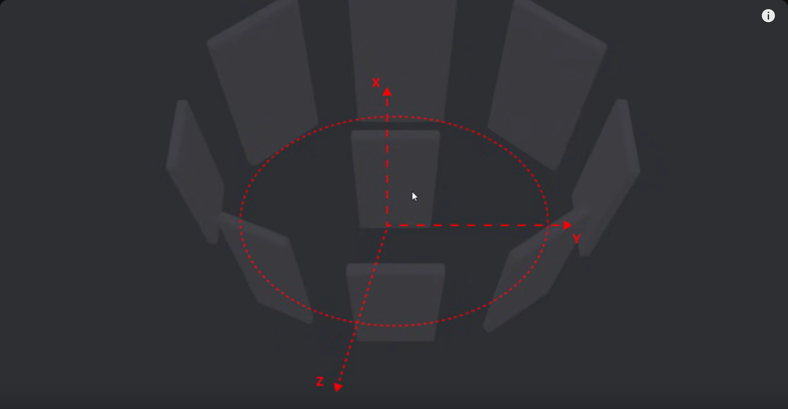
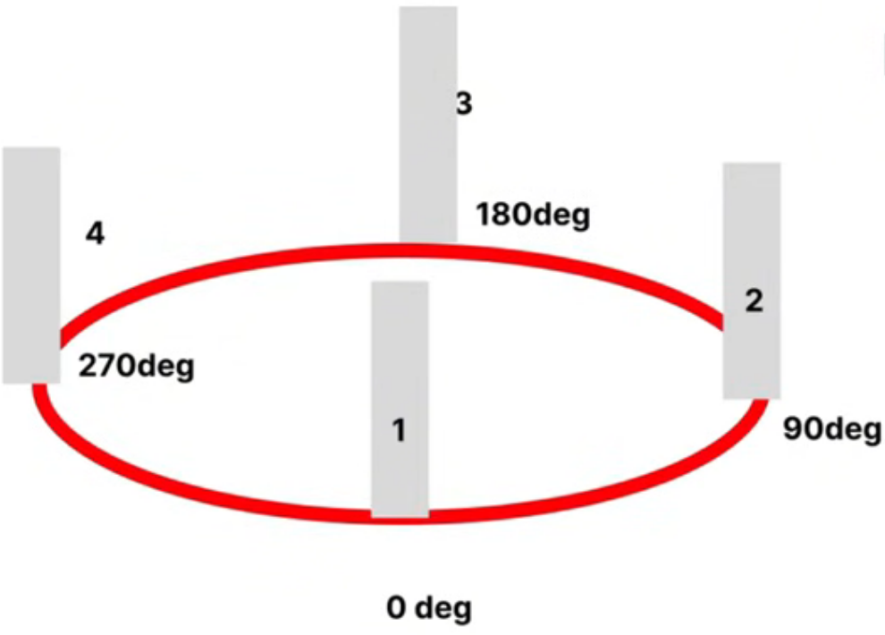

# About The Project

- [Create Crazy 3D Image Slider Effects Using CSS Only](https://www.youtube.com/watch?v=yqaLSlPOUxM)
- [youtube_v2/slider_3d](https://github.com/HoanghoDev/youtube_v2/tree/main/slider_3d/)

- Distance of each item
- 360deg / quantity
- 360/ 4 = 90deg
- **rotateY of item at position**: (position - 1) \* (360 deg/ quantity)
- **item 1**: (1-1) \* (360/4) = 0 \* 90 = 0deg
- **item 2**: (2-1) \* (360/4) = 1 \* 90 = 90deg

